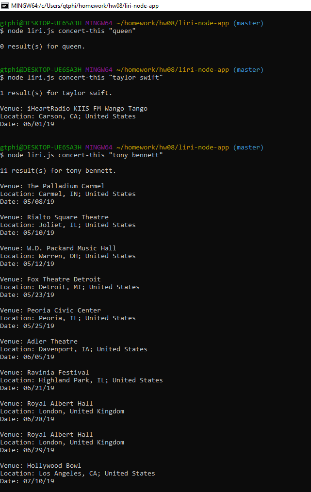
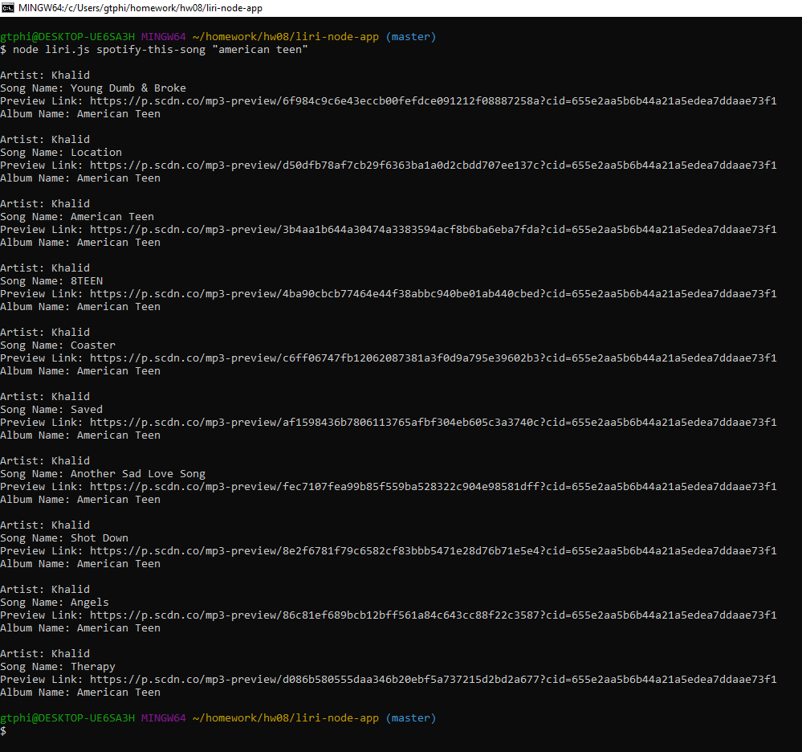
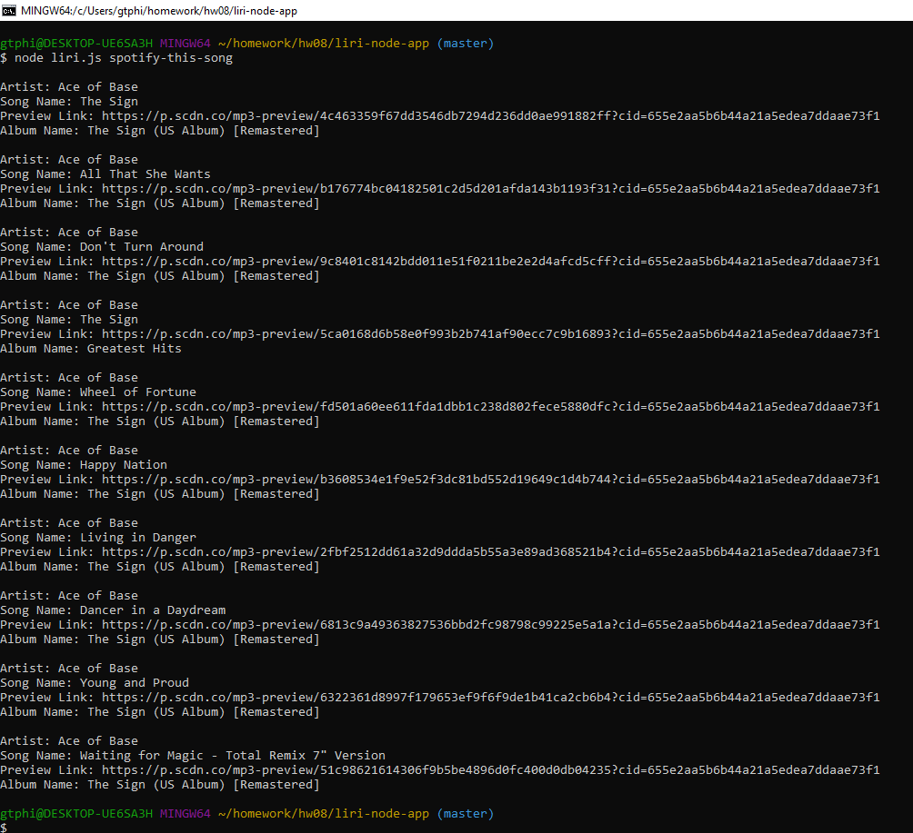
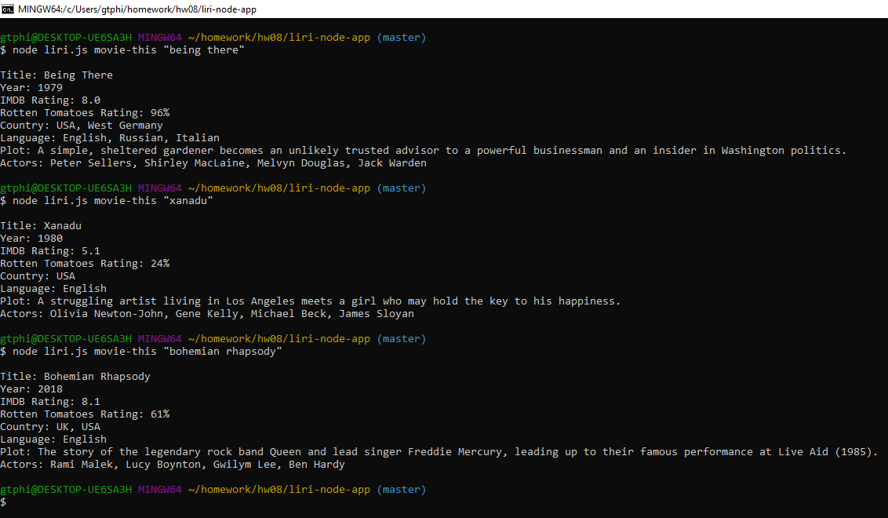
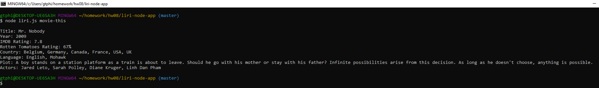

# liri-node-app

### Overview
LIRI is a _Language_ Interpretation and Recognition Interface.  It is a command line node app that takes in parameters and gives you back data.  
### Setup
1. Clone the repo.
2. In Terminal/Bash window, enter "npm install".
3. You will need to supply your own `.env` file.

### User Guide / Commands

liri.js can take in the following commands, one at a time:

1. `node liri.js concert-this <artist/band name here>`

    Searches the Bands in Town Artist Events API for an artist and renders the following information about each event:

     * Name of the venue
     * Venue location
     * Date of the Event (use moment to format this as "MM/DD/YYYY")

2. `node liri.js spotify-this-song '<song name here>'`

    Searches Spotify API and displays the following information about the song:

     * Artist(s)
     * The song's name
     * A preview link of the song from Spotify
     * The album that the song is from

    If no song is provided the program defaults to "The Sign" by Ace of Base.

3. `node liri.js movie-this '<movie name here>'`

    Searches the OMDB API and outputs the following information:
   
    * Title of the movie.
    * Year the movie came out.
    * IMDB Rating of the movie.
    * Rotten Tomatoes Rating of the movie.
    * Country where the movie was produced.
    * Language of the movie.
    * Plot of the movie.
    * Actors in the movie.

    If the user doesn't type a movie in, the program will output data for the movie 'Mr. Nobody.'
    
4. `node liri.js do-what-it-says`

    Reads the text inside of random.txt and then uses it to call one of LIRI's commands.  random.txt stored in the repo has contents: 'spotify-this-song,"I Want it That Way"'.

### Screen Shots

Screen shots showing execution of liri.js:

1.  concert-this:
    

2.  spotify-this:
    

3.  spotify-this with no song:
    

4.  movie-this:
    
    
5.  movie-this with no title:
    

6.  do-what-it-says:
    

## Author
Philip Hu

